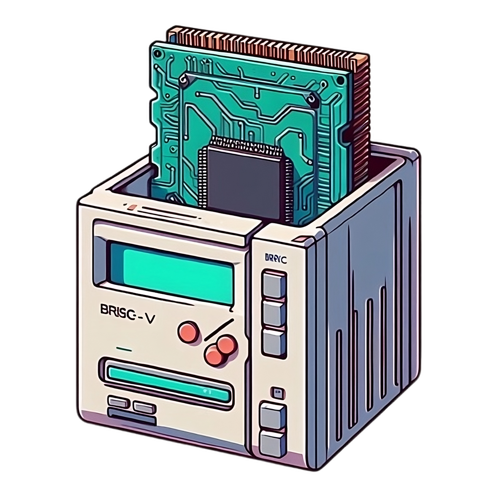

<h1>
  Brisc
  
  
  
</h1>

Brisc is a collection of libraries that assemble a RISC-V runtime. It is intended for executing single-threaded
programs targeting the unprivileged `riscv{32/64}i{mc}` ISAs.

### Development Status

`brisc` is currently in active development, and is not yet ready for use in production.

## Overview

- [`brisc-isa`](./crates/isa) - Types for supported instructions and decoding utilities.
- [`brisc-hw`](./crates/hw) - RISC-V Processor implementation (Pipeline stages, memory bus interface, register file, etc.)
- [`brisc-emu`](./crates/emu) - Single-Threaded RISC-V hart emulator with a 5-stage pipeline.

## Contributing

See [`CONTRIBUTING.md`](./CONTRIBUTING.md)
